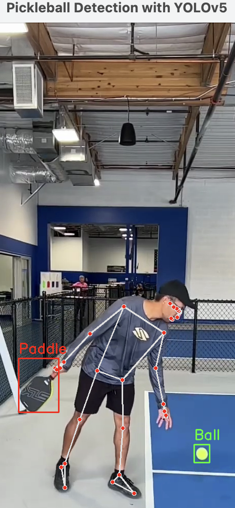

# PiServe: AI-Powered Pickleball Serve Detection

**Pickleball** is a fast-growing paddle sport that combines elements of tennis, badminton, and table tennis. Played on a small court with a perforated plastic ball, it’s a game of quick reflexes and strategic play. One of the most important aspects of pickleball is the **serve**, which must be executed according to strict rules to keep the game fair and competitive.

## Serve Rules in Pickleball

- **Underhand serve**: The ball must be struck below the server’s waist.
- **Upward arc**: The paddle must move in an upward arc, and the paddle head must be below the wrist at the moment of contact.
- **Behind the baseline**: The server must be positioned behind the baseline without stepping into the court before the ball is hit.

A legal serve is crucial to maintaining a fair game. Failing to comply with these rules can lead to a **fault** or a **loss of serve**, which could change the tide of the game. Players must be mindful of their serve technique to avoid being called out during a match.

# The Role of AI in Pickleball

AI has the potential to enhance the integrity of the game by providing real-time serve detection and analysis. With systems like PiServe, referees and players alike can benefit from automated assistance that tracks the ball, paddle, and player movements to ensure that every serve complies with the rules. This allows for consistent enforcement, helping referees make accurate and unbiased decisions, providing instant feedback to players on the legality of their serves, and enhancing training by offering insights into serving techniques.

This project demonstrates how **Computer Vision (CV)** can be leveraged to enhance visually assisted referee systems in sports like pickleball. By using real-time object detection and pose estimation, **PiServe** can accurately track the ball and player movements, ensuring compliance with serve regulations. This technology has the potential to reduce human error, improve game fairness, and provide instant feedback to players and referees. As CV continues to evolve, its applications in sports officiating and training will play a crucial role in maintaining the integrity of competitive events.
